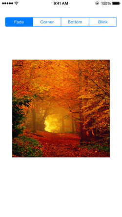

# EJImageLiker


EJImageLiker is a simple "Like Animation" for images on iOS. 



Project allows for different animations after double tapping on an image.

Usage
==================
-Add the like icons to your project's Assets catalog 

(Make sure the icon names match what's in the file. "Favorite" and "Favorite-black")

Add the header file to your source code
```objective-c
#import "EJImageLiker.h"
```

Create an instance of EJImageLiker
```objective-c
    EJImageLiker *liker = [[EJImageLiker alloc]initWithFrame:CGRectMake(100,200, 200, 200) andImage:[UIImage imageNamed:@"fall"]];
    [self.view addSubview:liker];
```

Set the AnimationStyle
```objective-c
    [liker setAnimationStyle:AnimationStyleFade]; // default
    /* OR */
    [liker setAnimationStyle:AnimationStyleBlink];
    /* OR */
    [liker setAnimationStyle:AnimationStyleMoveToCorner];
    /* OR */
    [liker setAnimationStyle:AnimationStyleStayOnBottom];
```

Choose the color of favorite icon
```objective-c
    [liker setLikerImageColor:LikerColorWhite]; // default
    /* OR */
    [liker setLikerImageColor:LikerColorBlack];
```
